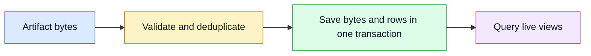

# Storage v1

Store artifact bytes and query their projected rows. SQL is the data model;
[JSON Schemas](../../schemas/v1/) validate inputs.

| Database | Driver | Live dashboard |
|---|---|---|
| [SQLite](sqlite/) | Standard-library `sqlite3` | Unscoped; single operator |
| [PostgreSQL 14+](postgres/) | `psycopg>=3` + libpq, or `psycopg[binary]` | Scoped by session `traust.project_ids` |



## Using Store

[Python example](../../README.md#storage-contract). Supply an idle, caller-owned connection
and `layer_id`; omitted `project_id` defaults to `local`. PostgreSQL permissions are caller-owned.
Optional `storage.yaml` supplies `context.storage.dsn` through the existing config loader;
the caller opens the connection. Store never loads config or applies environment overrides.

| Operation | Rule |
|---|---|
| Initialize | Requires storage v1, revision **1**. Fresh DBs bootstrap; version mismatches need explicit migration. |
| Ingest | Original bytes and projected rows commit together or not at all. Rejected bytes remain in `IngestError.payload`. |
| Retry | Identical bytes are a no-op. Digests are global: the first layer/project association wins. |
| Correct | New bytes update matching rows without deleting omitted rows. Replaying old bytes does not undo corrections. |

## SQL files

Each database has **`schema/<table>.sql` — one file containing the table and all of its
indexes**, `queries/` for parameterized operations, and **`views/<name>.sql` — one file per
view**. Every artifact schema has a projection; nested objects and arrays remain JSON until a
query earns a child table. Files bootstrap in deterministic schema-then-view filename order.
Edit SQL directly; no generation step. Dialect migration placeholders remain under each
`migrations/` directory.

The dashboard counts by project, layer, repository, severity and verdict.
Missing layer metadata hides rows; missing triage yields NULL verdicts. Conflicting verdicts can
count a finding in multiple groups, so group counts are not necessarily additive.

## Checks

```bash
make test
```

PostgreSQL tests use a fixed local test DSN. They run automatically when `psycopg` and the
database are available; otherwise they warn and skip.
