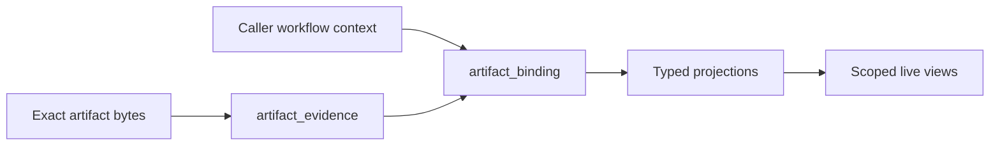

# Storage v1

Storage v1 retains exact artifact evidence and binds it to caller-owned workflow
context. SQL is the data model; [JSON Schemas](../../schemas/v1/) validate
artifact interpretations.

| Database | Driver | Scoped dashboard |
|---|---|---|
| [SQLite](sqlite/) | Standard-library `sqlite3` | Explicit scope list in the query |
| [PostgreSQL 14+](postgres/) | `psycopg>=3` + libpq, or `psycopg[binary]` | Transaction-local `traust.scope_ids` plus explicit query scope |



## Identity model

| Identity | Meaning |
|---|---|
| `digest` | SHA-256 of exact source bytes; evidence identity only |
| `binding_id` | Deterministic association of evidence, schema name, and context |
| `scope_id` | Authorization/deployment partition; defaults to `local` |
| `subject_id` | Optional stable analyzed target supplied by the host |
| `run_id` | Optional execution/result occurrence supplied by the host |
| `layer_id` | Optional Traust Ledger disposition-layer identity |

Storage treats caller identifiers as opaque UTF-8 strings. It rejects NUL
because PostgreSQL `TEXT` cannot represent it. Storage does not parse or
normalize repository fields, URLs, paths, or external project IDs.

`project_id` is not part of storage v1. External project identifiers inside an
artifact remain domain evidence and never become authorization scope implicitly.

## Binding identity

```text
sha256(
  "traust-binding-v1" 0x00
  artifact_digest     0x00
  artifact_name       0x00
  scope_id            0x00
  optional(subject_id)
  optional(run_id)
  optional(layer_id)
)

optional(value):
  absent  = 0x00
  present = 0x01 value 0x00
```

Fields are UTF-8 bytes without Unicode normalization. The presence marker
distinguishes absent from present-empty values.

Golden vector:

```text
artifact_digest = e3b0c44298fc1c149afbf4c8996fb92427ae41e4649b934ca495991b7852b855
artifact_name   = triage
scope_id        = local
subject_id      = sci:inventory-item:42
run_id          = absent
layer_id        = absent
binding_id      = 90933ec74bd66618428c4def90f4af4cb9a2ab60bc9bd24a20b64814ca2dba56
```

## Storage profiles

[`profiles.json`](profiles.json) is the hand-authored context/projection policy.
It covers every artifact schema exactly. Classes are `evidence-only`,
`run-bound`, `layer-bound`, `scope-ref`, or `aggregate`; each profile declares
required binding fields and its schema-specific projection table.

Every artifact contract has a durable SQL projection. Root scalars become typed
columns; nested objects and arrays remain JSON/JSONB until a query justifies
child tables. The common projection envelope is `binding_id` plus
`artifact_digest`; scope, subject, run, and layer context remain on
`artifact_binding`.

The first deeply exercised query slice is:

- `vuln-findings`: requires `subject_id` and `run_id`;
- `triage`: requires `subject_id` and `run_id`;
- `layer`: requires `layer_id`.

This slice limits the initial dashboard, not storage coverage. Every other
projection retains generated save and smoke-test coverage.

## Operations

| Operation | Rule |
|---|---|
| Initialize | Fresh databases bootstrap with the package's storage metadata; mismatches require explicit migration. |
| Save | Validate bytes, acquire one digest lock on PostgreSQL, insert evidence, insert binding, and write any projection in one transaction. |
| Retry | The same binding is a no-op and returns `AlreadyBound`. Evidence-level deduplication stays private. |
| Correct | A new binding names `supersedes_binding_id`; clocks never determine correction order. |
| Read evidence | Select by digest, recheck SHA-256, and return exact bytes without a schema claim. |
| Typed read | Select by binding ID, require the requested artifact name, recheck evidence, revalidate the schema, and return exact bytes. |

`supersedes_binding_id` is a nullable soft reference. A successor must match its
predecessor's scope, artifact name, subject, run, and layer context. One binding
may have at most one direct successor. The `current_binding` view returns
bindings with no successor in the same scope.

PostgreSQL uses one advisory transaction lock derived from the first eight
digest bytes. Binding idempotency relies on its primary key; there is no second
advisory lock.

## Scoped views

Scoped views compose current bindings with schema projections. They correlate
workflow context through scope, subject, and run identifiers and may enrich
display data through optional layer bindings. They never derive repository
identity from artifact strings. Dashboard-specific metrics and additional
relational projections remain consumer-driven work.

PostgreSQL sets a JSON scope list in transaction-local `traust.scope_ids` and
reads the security-barrier view on the same connection and transaction. SQLite
applies the same JSON scope list in the list query.

## SQL ownership

Each database has one authored file per table, parameterized queries under
`queries/`, and one file per view. Evidence and binding tables bootstrap before
projection tables; views follow in dependency order. Edit SQL directly. SDKs
generate private query bindings from this canonical source.

The database FK from binding to evidence, and projection FKs to both, protect
storage-internal integrity. Cross-artifact domain references remain soft.

## Compatibility

Earlier experimental schemas were never published or used and have no migration
contract. Recreate those databases rather than treating them as storage v1.

## Checks

```bash
make lint-fix
make test
```

PostgreSQL tests use the fixed local test DSN. They run when `psycopg` and the
database are available; otherwise they warn and skip.
